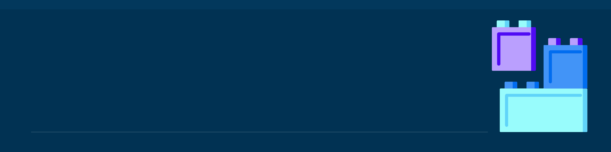

<!--- ](https://linktr.ee/johncanero) -->

<!-- <h1 align="center">
  
</h1>
 -->
<h1 align="left">I'm Jam </h1>

Software Engineer, Web Developer & Architectural Designer
--------------------------------------

I am on an adventure delivering web applications and exploring technologies. 

- 🌍 I'm Filipino based in the Philippines 🇵🇭
- 🏛️ I’m currently an Architecture Student
- ✉️ You can contact me at: https://www.linkedin.com/in/johncanero/
- 🧠 I'm learning React Js, Next Js, Flutter and React Native
- ⚡ I'm a Self-Taught Web Developer
- ⚽ Hobbies: Reading Books, Football, Cycling, Running
- 🧐 Interested in React Native, Flutter and UI/UX Design
- 💻 Visit my website at: https://johncanero.com/

## 💼 Tech Stack

     	         

## 💻 IDEs/Editors

 

<!--   -->

## 🕓 Version Control 

 

## 🕓 Design Graphics

    

### Socials 

 &nbsp;&nbsp; &nbsp; &nbsp; &nbsp; 

<h1> Development Projects </h1>

Website
- John Cañero Website - https://johncanero.com/
- John Cañero Blog - https://johncanero-blog.vercel.app/
- Upskill Hub - https://upskillhub-by-johncanero.vercel.app/
- Likha Design Agency - https://likha-design-agency-by-johncanero.vercel.app/

Full Stack Applications
- John Cañero Blog - https://johncanero-blog.vercel.app/
- NewsFlasher Live News App - https://newsflasher-bulletin-by-johncanero.vercel.app/

Landing Page
- Architecture News Website - https://architecture-news-website.vercel.app/
- Lead Digital Landing Page - https://lead-digital-by-johncanero.vercel.app/
- Remote Landing Page - https://remote-landing-page-by-johncanero.vercel.app/

Commercial Cards
- E-Commerce Product Page - https://tech-jam-by-johncanero.vercel.app/
- Product Nike Shoe Card - https://shoe-product-card-by-johncanero.vercel.app/
- AirBnb Clone - https://airbnb-clone-by-johncanero.vercel.app/

API Generator
- WeatherCast: Weather App - https://weathercast-app-react-by-johncanero.vercel.app/
- Advice Generator App - https://advice-generator-app-by-johncanero.vercel.app/

## Blogger at <a href="https://medium.com/@johncanero">Medium</a> </h2>
Started blogging on about investing on oneself, realizations & thoughts and life. 

|  |  |
| ------------- | ------------- |

